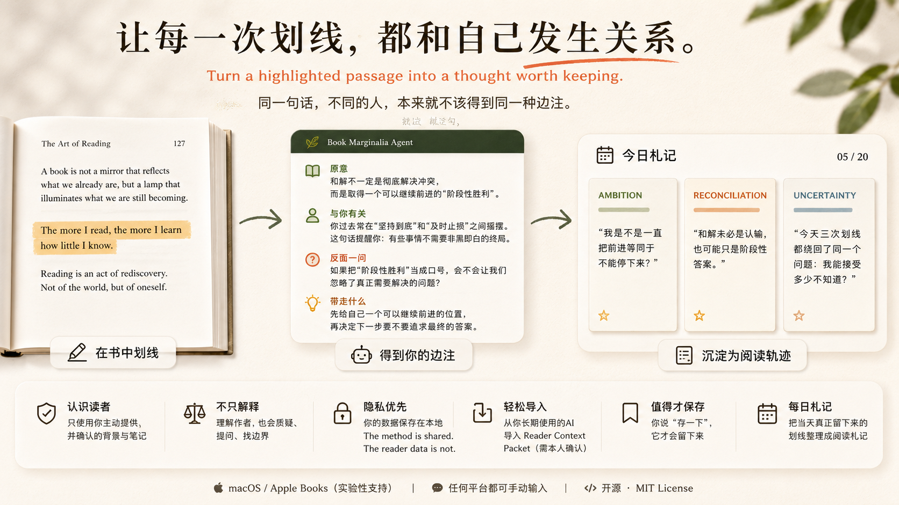

# Book Marginalia Agent

> **The same passage should not produce the same note for every reader.**

**Turn a highlighted passage into a thought worth keeping.**

<p align="center">
  
</p>

Book Marginalia Agent is an open [Agent Skill](https://github.com/openai/skills) for **personal, critical reading notes**.

It does more than explain what a passage means.

It can connect a passage to the reader's own verified context, question the author's assumptions, turn a highlight into a useful thought, and gradually build a reading journal that reflects **how this particular reader thinks**.

Most AI reading tools answer:

> **What does this passage mean?**

Book Marginalia Agent also asks:

> **Why might this matter to you?**
> **Is the author necessarily right?**
> **What do you think after reading it?**

The method is shared.

**The reader data is not.**

---

## Why

We highlight a lot of sentences.

At the moment, they feel important enough to save. But weeks or months later, a highlight often becomes just another piece of text.

We forget:

* why we highlighted it;
* what it reminded us of;
* whether we actually agreed with the author;
* what changed in our own thinking.

Most highlight tools preserve the **sentence**.

Most AI summaries preserve the **author's meaning**.

Book Marginalia Agent focuses on the missing step between them:

> **helping the reader form a response worth keeping.**

A default marginal note contains four parts:

* **Meaning** — what the author is actually claiming.
* **Personal connection** — a relevant connection to the reader's verified context, when one exists.
* **Challenge** — a boundary, counterexample, missing premise, or structural explanation.
* **Takeaway** — one question, observation, decision, or small experiment worth carrying forward.

It avoids generic praise, invented memories, and the habit of turning every paragraph into productivity advice.

---

## What makes it different

### 1. It can know who is reading

The same sentence can mean something very different to different people.

A passage about ambition, compromise, intimacy, failure, freedom, or leaving home may connect to completely different experiences depending on the reader.

Book Marginalia Agent can use a reader's **opt-in local profile, notes, previous marginalia, or reviewed Reader Context Packet** to make those connections.

If there is no relevant context, it must say so.

It should never invent a memory just to make a note feel personal.

---

### 2. It does not automatically agree with the author

Good reading is not only understanding.

The agent can also ask:

* Where does this claim stop being true?
* What assumption is hidden underneath it?
* Is there a counterexample?
* Is the author turning a structural problem into an individual problem?
* What evidence would change the conclusion?

The goal is not to manufacture disagreement.

The goal is to make reading **active rather than obedient**.

---

### 3. It turns highlights into a reading history

A highlight is useful in the moment.

A sequence of highlights can reveal how a reader's thinking is changing.

When the reader explicitly chooses to save a note, Book Marginalia Agent can keep it in a private local vault.

At the end of the day, saved highlights can be synthesized into a reading journal containing:

* recurring themes;
* important passages;
* connections to previous notes;
* emerging disagreements with the author;
* unresolved questions;
* ideas worth revisiting.

The result is not just a summary of the book.

It is a record of **what happened between the book and the reader**.

---

## Example

Suppose the reader highlights:

> “The art of reconciliation is often the art of achieving a temporary victory.”

And says:

```text
Use $book-marginalia-agent. 就这句。
```

Instead of only producing:

> “The author means that reconciliation does not require permanently solving every conflict.”

the agent can continue:

**Meaning**

Reconciliation may mean reaching a position that is good enough to continue from, rather than permanently resolving the contradiction.

**Personal connection**

If verified reader context contains a genuinely related recurring question, the agent can connect the passage to it and identify where that context came from.

**Challenge**

When does “temporary victory” become a respectable name for avoiding a problem that actually needs to be solved?

**Takeaway**

Perhaps some conflicts need a final answer, while others only need a workable next stage.

That is the kind of thought Book Marginalia Agent is designed to preserve.

---

## What works today

* “Just this passage” / “就这句” balanced marginalia.
* Explain, connect, challenge, and apply modes.
* Experimental Apple Books capture on macOS through Codex Desktop's Computer Use capability.
* Manual passage input for any reader or platform.
* A private, per-reader local vault.
* A provider-neutral import flow for reader-approved context from any long-used AI.
* Explicit save and daily reading-note workflows.
* A dependency-free Python helper for safe vault initialization and append-only capture.

Apple Books capture is intentionally labelled **experimental**.

The agent can inspect visible page context and highlights, but Apple Books does not expose a general public API for its complete highlight database.

Manual passage input remains the reliable fallback.

---

## Reading modes

The agent supports several ways of responding to a passage.

```text
就这句。
```

Balanced marginalia: meaning + connection + challenge + takeaway.

```text
说人话。
```

Explain the author's claim clearly.

```text
联系我。
```

Connect the passage to verified reader context.

```text
反驳一下。
```

Test the author's assumptions, boundaries, and counterexamples.

```text
这句话怎么用？
```

Turn the passage into a useful question, observation, experiment, or decision.

```text
存一下。
```

Save the passage and marginalia.

```text
生成今日札记。
```

Synthesize the day's saved reading notes.

---

## Bring context from the AI that already knows you

A long-used AI may already know a lot about how a reader thinks.

Book Marginalia Agent does **not** require access to that account.

Instead, the reader can ask an existing AI — ChatGPT, Claude, Gemini, Copilot, a local model, or another assistant — to generate a short **Reader Context Packet**.

Say:

```text
Use $book-marginalia-agent. Help me import my reader context from the AI I already use.
```

The workflow is intentionally review-first:

```text
Existing AI
    ↓
Reader Context Packet
    ↓
Reader reviews / edits it
    ↓
Explicit confirmation
    ↓
Private local vault
    ↓
Book Marginalia Agent
```

The returned Markdown remains a draft until the reader reviews it and says:

```text
确认导入
```

This is intentionally **not automatic memory sync**.

The agent does not ask for:

* account credentials;
* passwords;
* API keys;
* OAuth access;
* a complete private chat archive.

The complete workflow and export prompt live in:

[`references/context-import.md`](skills/book-marginalia-agent/references/context-import.md)

---

## Privacy model

The public repository contains only:

* the reading method;
* schemas;
* helper code;
* documentation;
* invented test data.

Each reader has a separate local vault:

```text
BookMarginalia/
├── profile.md       # facts the reader explicitly provided
├── memories/        # opt-in personal notes
│   └── imports/     # reader-approved context packets from any AI
├── highlights/      # saved passages and marginalia
└── daily/           # generated reading journals
```

The agent must:

* use only verified reader context;
* show which memory source informed a personal connection;
* say when no relevant memory was found;
* keep agent interpretation separate from the reader's own words;
* never save a passage or personal fact without an explicit request or enabled capture setting;
* never place a reader vault inside this repository.

Personalization should make the reading more relevant.

It should never require the reader to surrender ownership of their personal history.

---

## Install in Codex

Clone the repository:

```bash
git clone https://github.com/dudu913019449-creator/book-marginalia-agent.git
```

Copy the skill into your personal Codex skills directory:

```bash
cp -R book-marginalia-agent/skills/book-marginalia-agent ~/.codex/skills/
```

The skill becomes available in a new Codex turn as:

```text
$book-marginalia-agent
```

---

## Try it

### Apple Books on macOS

Highlight a passage, then say:

```text
Use $book-marginalia-agent. 就这句。
```

Other useful requests:

```text
说人话。
联系我，但没有相关记忆就直说。
反驳一下。
这句话怎么用？
存一下。
生成今日札记。
```

### Any other reading app

Paste the passage directly:

```text
Use $book-marginalia-agent on this passage:

“An invented example passage goes here.”
```

Manual passage input works regardless of reading platform.

---

## Local vault helper

The helper uses only the Python standard library.

### Initialize a vault

```bash
python3 skills/book-marginalia-agent/scripts/vault.py init \
  --vault ~/Documents/BookMarginalia
```

### Append a structured JSON entry

```bash
python3 skills/book-marginalia-agent/scripts/vault.py add \
  --vault ~/Documents/BookMarginalia \
  --entry /path/to/entry.json
```

### Read one day's saved entries

```bash
python3 skills/book-marginalia-agent/scripts/vault.py list-day \
  --vault ~/Documents/BookMarginalia \
  --date 2026-08-28
```

### Import a reviewed Reader Context Packet

```bash
python3 skills/book-marginalia-agent/scripts/vault.py import-context \
  --vault ~/Documents/BookMarginalia \
  --input /path/to/reader-context.md \
  --source "My long-used AI" \
  --date 2026-08-28 \
  --confirmed-by-reader
```

The JSON schema and Markdown format live in:

[`references/note-format.md`](skills/book-marginalia-agent/references/note-format.md)

---

## Project structure

```text
skills/book-marginalia-agent/
├── SKILL.md
├── agents/
│   └── openai.yaml
├── references/
│   ├── note-format.md
│   ├── context-import.md
│   ├── personalization.md
│   └── quality-rubric.md
└── scripts/
    └── vault.py
```

---

## Test

```bash
python3 -m unittest discover -s tests -v
```

---

## Roadmap

* Improve selection detection across themes and highlight colors.
* Add importers for exported highlights without coupling the core skill to one service.
* Add an optional keyboard shortcut or menu-bar shell around the agent.
* Explore better cross-book connections between saved notes.
* Evaluate saved-note rate and reader edits before building a full reading app.

---

## 中文简介

### 我们划下的，往往不只是一句话。

有些句子会在某个时刻突然击中你。

于是你划线、收藏、截图。可过一阵子再翻回来，常常只剩下一句孤零零的话。你已经不太记得，当时为什么停在这里，它让你想起了什么，你究竟认同作者，还是只是被某种情绪打动。

**Book Marginalia Agent 想留下的，不只是那句话，而是你读到它时发生过的思考。**

它不是一个“帮你总结这段话”的 AI。

它更关心：

> **这句话为什么会让你停下来？**
> **它和你过去的经历、旧想法有什么关系？**
> **作者一定是对的吗？**
> **读完以后，你自己的看法是什么？**

---

### 就这句。

在 Mac 的 Apple Books 中划下一句话，然后说：

```text
就这句。
```

Agent 会从四个方向回应：

* **原意**：先弄清作者真正想表达什么；
* **与你有关**：如果你的背景、旧笔记或长期思考里存在真正相关的内容，就把那条线连起来；
* **反面一问**：寻找这句话的边界、反例、隐藏前提，或者作者没有看到的另一面；
* **带走什么**：最后留下一个值得继续想的问题、判断或行动。

它不会为了显得聪明，把一句简单的话重新解释得更复杂。

也不会因为作者写在书里，就默认作者一定是对的。

有时候，一本书真正留下来的东西，并不是作者给你的答案，而是你第一次意识到：

> **这里，我好像并不同意他。**

---

### 同一句话，不同的人，本来就不该得到同一种边注。

一个准备离开熟悉城市的人，和一个刚刚决定留下来的人，读到“远方”，感受到的东西不会一样。

一个正在失去什么的人，和一个终于放下什么的人，读到“和解”，也不会一样。

所以 Book Marginalia Agent 可以使用你**主动提供并确认过**的经历、背景、旧笔记和 Reader Context Packet。

不是为了给每一句话都强行套上一段人生故事。

而是因为真正的阅读，本来就会和一个人的过去发生关系。

有关系，就把那条线连起来。

没有，就说没有。

它不会为了假装“懂你”，编一句：

> “你可能也曾经经历过……”

---

### 有些边注，值得留下。

如果某一句真的让你停了一会儿，可以说：

```text
存一下。
```

它才会进入你的个人资料库。

一天结束以后，再说：

```text
生成今日札记。
```

Agent 会把当天真正保存下来的划线重新放在一起。

你可能会发现，自己今天一直在反复想同一件事。

也可能发现，几本完全不同的书，竟然在回答同一个问题。

久一点以后，这些边注就不只是“我读过哪些书”的记录。

它们更像一条慢慢形成的轨迹：

> **你曾经相信什么，怀疑什么，又在什么时候改变了自己的看法。**

---

### 让已经了解你的 AI 把“你”带过来

如果你已经长期使用 ChatGPT、Claude、Gemini、Copilot 或其他 AI，不需要再从头向 Book Marginalia Agent 介绍自己。

你可以让原来的 AI 帮你整理一份简短的 **Reader Context Packet**。

其中可以包含：

* 重要经历；
* 反复思考的问题；
* 价值观与内在冲突；
* 阅读偏好；
* 已确认事实、AI 推断与仍然不确定的信息。

你本人先阅读、删除、修改。

只有在你明确确认以后，它才会被导入。

不需要提供账号或密码。
不需要 API Key。
也不需要交出完整聊天记录。

**The method is shared. The reader data is not.**

---

Book Marginalia Agent 最后想做的，其实是一件很简单的事：

> **多年以后重新翻到这一页时，你看到的不只是作者当年写了什么。**
>
> **你也能看见，那时候的自己是怎么想的。**

---

## License

[MIT](LICENSE)
